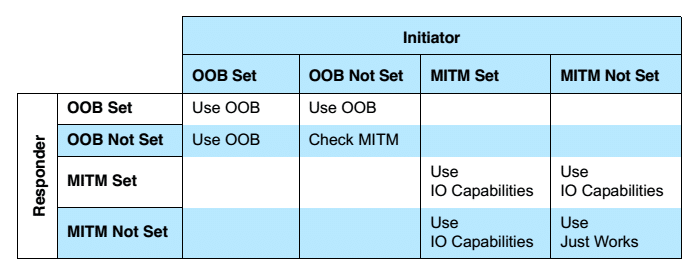
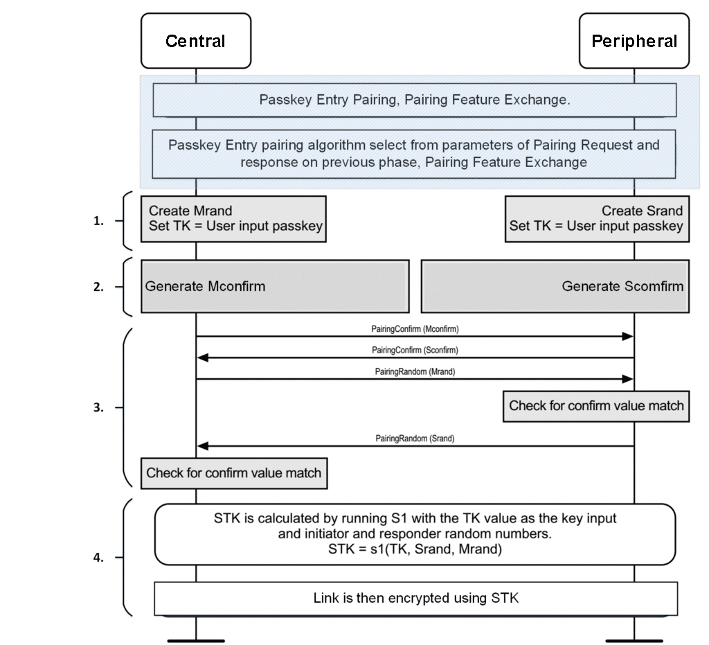

# Pairing Bluetooth

## 1. Pairing Feature Exchange

In questa fase del processo di **Pairing** avviene lo scambio delle funzionalità di sicurezza supportate e *abilitate* rispettivamente dai dispositivi.


- **Pairing Request** packet
- **Pairing Response** packet

<br />

*Struturra di un `pairing request\response packet`*:
```
+------------+----------+----------+----------+--------------------------------+------------+--------------+--------------+
|   Field    |   Code   |  IO Cap  |  OOB DF  |            AuthReq             |     Max    |  Initiator   |   Responder  |
|            |          |          |          |            (1 Byte)            | Encryption |     Key      |     Key      |
+------------+ (1 Byte) | (1 Byte) | (1 Byte) +----+------+----+----+----------+  Key Size  | Distribution | Distribution |
| Sub-define |          |          |          | BF | MitM | SC | KP | Reserved |  (1 Bytes) |  (1 Bytes)   |  (1 Bytes)   |
+------------+----------+----------+----------+----+------+----+----+----------+------------+--------------+--------------+
|    Bits    |    8     |    8     |    8     | 2  |  1   | 1  | 1  |    3     |     8      |      8       |      8       |
+------------+----------+----------+----------+----+------+----+----+----------+------------+--------------+--------------+
```

I bit che specificano quali sono le funzionalità di sicurezza supportate da un dispositivo sono:

- **IO Cap**, capacità di **Input** e **Output** del dispositivo.

    Per **capacità di input** si intende se il dispositivo è dotato di **keyboard** o di bottoni, questo ultimo forma il campo **yes/no**:

    | Capability | Descrizione                                                                                      |
    |------------|--------------------------------------------------------------------------------------------------|
    | No input   | Il dispositivio non ha modo di indicare 'yes' o 'no'                                             |
    | Yes/No     | Il dispositivo ha almeno 2 bottoni per indicare 'yes' e 'no'                                     |
    | Keyboard   | Il dispositivo ha almeno 2 bottoni per indicare 'yes' e 'no' + una tastiera con input da **0-9** |

    Per **capacità di output** si intende se il dispositivo è dotato di un **display** o un mezzo per comunicare il "codice":

    | Capability     | Descrizione                                                                     |
    |----------------|---------------------------------------------------------------------------------|
    | No output      | Il dispositivo non ha un display o l'abilità di comunicare il codice di 6 cifre |
    | Numeric output | Il dispositivo ha un display o l'abilità di comunicare il codice di 6 cifre     |

    Le due tipologie di capacità vengono unite per formare la **matrice** che definisce le **IO Cap**:
    
    |              | **NoOutput**    | **NumericOutput** |
    |--------------|-----------------|-------------------|
    | **NoInput**  | NoInputNoOutput | DisplayOnly       |
    | **Yes/No**   | NoInputNoOutput | DisplayYesNo      |
    | **Keyboard** | KeyboardOnly    | KeyboardDisplay   |

    *Le righe rappresentano il **Local Output Capacity**, invece le colonne il **Local Input Capacity***

    In base a quela cella caratterrizza il dispositivo, il byte verrà valorizzato con un valore specifico.

- **OOB DF**, specifica l'utilizzo di un canale esterno (**Out-of-Band**) per lo scambio di alcune informazioni usate in fase di pairing.

    Generalmente questo byte viene valorizzato a:

    | Value     | Descrizione                     |
    |-----------|---------------------------------|
    | 0x00      | OOB Authentication non presente |
    | 0x01      | OOB Authentication presente     |
    | 0x02-0xFF | Riservato                       |

    Si tende a preferire l'utilizzo di canali di comunicazione wireless come:

    - **NFC**
    - **QRCode**

- **MitM**, il device richiedere la protezione da attacchi "Man-in-the-Middle".

    TODO: Bluetooth Core Specification v4.2, Vol1, Part A, 5.2.3.

- **SC**, richiedere l'utilizzo AGGIUNGI LINK FASE **LE Secure Connection** pairing.

    > [!NOTE]
    > Solo se entrambi i dispositivi richiedono l'utilizzo di LE Secure Connection verrà utilizzata.
    > Se anche solo 1 dispositivo non richiede l'utilizzo, allora verrà usato i metodi di **Legacy Pairing**.

- **KP**, TODO:

- **Maximum Encryption Key Size**, grandezza massima della chiave.

    Può variare con un range **da 7 a 16 ottetti**.

- **Initiator Key Distribution** & **Responder Key Distribution**, TODO:

<br />

Con lo scambio di queste informazioni, soprattutto quelle contenute nel byte **IO Cap** (TODO: aggiungi link), i dispositivi possono scegliere quale **pairing method** e **key generation** (TODO: aggiungi link) utilizzare.

## 2. Key Generation Methods

Dopo lo scambio delle informazioni e sulle capacità di sicurezza in fase 1 dai dispositivi, i dispositivi possono scegliere quale **metodo di pairing** e di **generazione della chiave** utilizzare.
Principalmente ci sono 2 famiglie:

- **Bluetooth LE Legacy Pairing**
- **Bluetooth LE Secure Pairing**

La scelta di una delle due è determinata in base se il bit **SC** viene abilitato o meno da entrambi i dispositivi.

Queste due categorie ragruppano i seguenti metodi per la **generazione della chiave**:

Bluetooth LE Legacy Pairing:

- **Just Works**
- **Passkey**
- **Out-of-Band(OOB)**

Bluetooth LE Secure Pairing:

- **Numeric Comparison**

> [!NOTE]
> Bluetooth LE Secure Pairing non esclude i metodi di generazione della chiave di LE Legacy Pairing, ma semplicemente lo estende con un nuovo metodo definito sicuro.

La fase di decisione sul metodo di generazione della chiave segue i seguenti steps:

1. **Controllo del bit SC**, se è uguale a **1** da entrambi i lati, allora viene usata **LE Secure Pairing**; altrimenti **LE Legacy Pairing**.

2. (LE Secure Pairing) **Selezionare il metodo di generazione di chiave**, vengono controllati i valori di:

    - **OOB DF**
    - **MitM**

    In base a come sono valorizzati, si segue la seguente matrice per selezionare il metodo:

    

    ***Check MITM** significa ignorare **OOB Data Flag***.

    >[!NOTE]
    > TODO: aggiungere un commento perchè sia necessario avere almeno uno dei due bit valorizzati.

3. (LE Legacy Pairing) **Selezionare il metodo di generazione di chiave in base alle IO Cap**.

    Al contrario di LE Secure Pairing, qua possiamo direttamente controllare le **IO Cap** per determinare il metodo da utilizzare:

    

## 3. Key Generation - LE Legacy Pairing w/ Passkey method

1. **Temporary Key (TK)** e **Random Number Generation**

    Ogni dispositivo genera una **TK** (in base alla *IO Cap* disponibili)

    - Se uno dei due dispositivi (*initiating* o *responding*) ha abilitata la **display** capability, allora quest ultimo dispositivo genera un numero tra 000000 e 999999.
    L'altro dispositivo necessita di avere la **keyboard** capability per immetere il codice a 6 cifre mostrato dall'altro dispositivo.

    - (**Caso speciale**) Se nessuno dei due dispositivi dispone della **display** capability, ma entrambi dispongono della **keyboard** capability allora è responsabilità dell'utente garantire che le TKs siano uguali.

    Una volta che il valore di **TK** è pronto, i due dispositivi generano due numeri random a 128-bit:

    - **Mrand**, per **initiating device**
    - **Srand**, per **responding device**

2. **Mconfirm** e **Sconfirm**

    **Mconfirm** e **Sconfirm** sono valori a 128-bit calcolati tramite una funzione *c1* che prene come parametri:

    - **TK**
    - **Mrand** per *Mconfirm*; o **Srand** per *Sconfirm* calcolo
    - **Pairing Request command**
    - **Pairing Response command**
    - **Initiating device address type**
    - **Initiating device address**
    - **Responding device address type**
    - **Responding device address**

    TODO: aggiungere specifiche Bluetooth Core Spec V4.2, Vol.3, Part H, Section 2.2.3.

3. **Verifica**

    Quando **Mconfirm** e **Sconfirm** sono pronti, vengono scambiati tra i dispositivi e ricalcolati i valori:

    - *initiating device* trasmette Mconfirm al *responding device*
    - *responding device* trasmette Sconfirm al *initiating device*
    - *initiating device* riceve Sconfirm, trasmette Mrand al *responding device*:

        - Se il valore di **Mconfirm** calcolato dal *responding device* corrisponde con quello trasmesso dal *initiating device*, allora continua il paring e il *responding device* trasmette Srand al *initiating device*
        - Se il valore di **Mconfirm** calcolato dal *responding device* NON corrisponde con quello trasmesso dal *initiating device*, la procedura di pairing fallisce con "Confirm Value Failed".
    
    Le stesse operazioni le svolge *initiating device* con **Sconfirm**; se la procedura termina con successo, allora *initiating device* calcola la **Short Term Key** e avverte il Controller di abilitare la cifratura dei messaggi.

4. **STK Generation**

    La chiave viene generata da una funzione s1 che prende come parametri:

    - **TK**
    - **Srand**
    - **Mrand**

    TODO: aggingere specifiche Bluetooth Core Spec V4.2, Vol.3, Part H, Section 2.2.4.


